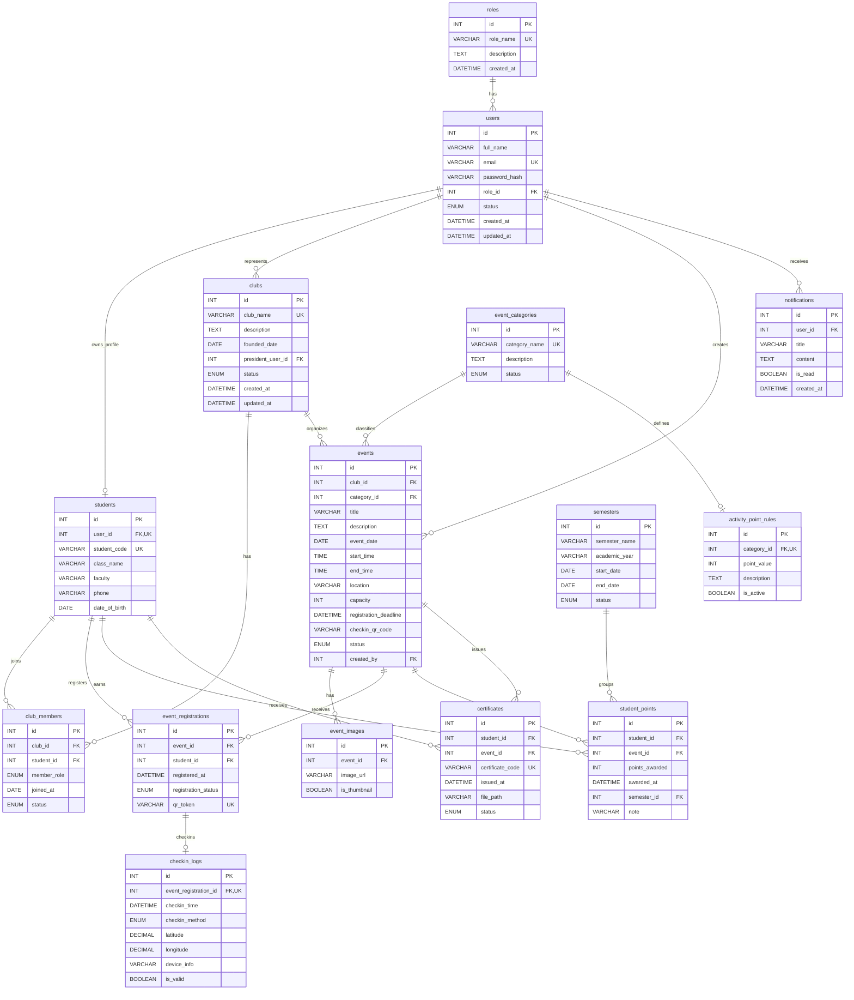

# ERD - Web Quản lý Sự kiện và Câu lạc bộ Sinh viên

## 1. Tổng quan

Hệ thống quản lý câu lạc bộ và sự kiện sinh viên gồm 15 bảng chính. Mô hình dữ liệu tập trung vào các nghiệp vụ:

- Quản lý tài khoản và phân quyền: `roles`, `users`.
- Quản lý hồ sơ sinh viên và câu lạc bộ: `students`, `clubs`, `club_members`.
- Quản lý sự kiện, đăng ký và check-in QR: `event_categories`, `events`, `event_images`, `event_registrations`, `checkin_logs`.
- Quản lý điểm rèn luyện, học kỳ và chứng nhận: `activity_point_rules`, `student_points`, `semesters`, `certificates`.
- Gửi thông báo hệ thống: `notifications`.

## 2. Danh sách bảng

| Bảng | Khóa chính | Khóa ngoại chính | Ý nghĩa |
|---|---|---|---|
| `roles` | `id` | - | Lưu danh sách vai trò như Admin, Club Manager, Student. |
| `users` | `id` | `role_id` -> `roles.id` | Tài khoản đăng nhập của toàn hệ thống. |
| `students` | `id` | `user_id` -> `users.id` | Thông tin riêng của sinh viên. |
| `clubs` | `id` | `president_user_id` -> `users.id` | Thông tin câu lạc bộ và người đại diện. |
| `club_members` | `id` | `club_id` -> `clubs.id`, `student_id` -> `students.id` | Quan hệ thành viên giữa sinh viên và câu lạc bộ. |
| `event_categories` | `id` | - | Phân loại sự kiện: Workshop, Seminar, Volunteer, Competition, Club Meeting. |
| `events` | `id` | `club_id` -> `clubs.id`, `category_id` -> `event_categories.id`, `created_by` -> `users.id` | Bảng trung tâm lưu thông tin sự kiện. |
| `event_images` | `id` | `event_id` -> `events.id` | Ảnh banner hoặc ảnh minh họa sự kiện. |
| `event_registrations` | `id` | `event_id` -> `events.id`, `student_id` -> `students.id` | Lượt đăng ký tham gia sự kiện. |
| `checkin_logs` | `id` | `event_registration_id` -> `event_registrations.id` | Lịch sử check-in, hỗ trợ ngăn quét QR trùng. |
| `activity_point_rules` | `id` | `category_id` -> `event_categories.id` | Quy tắc cộng điểm theo loại sự kiện. |
| `student_points` | `id` | `student_id` -> `students.id`, `event_id` -> `events.id`, `semester_id` -> `semesters.id` | Lịch sử điểm rèn luyện đã cộng cho sinh viên. |
| `semesters` | `id` | - | Học kỳ và năm học dùng để tổng hợp điểm. |
| `certificates` | `id` | `student_id` -> `students.id`, `event_id` -> `events.id` | Chứng nhận tham gia sự kiện. |
| `notifications` | `id` | `user_id` -> `users.id` | Thông báo gửi tới người dùng. |

## 3. Mô tả quan hệ

| Quan hệ | Kiểu | Mô tả nghiệp vụ |
|---|---:|---|
| `roles` -> `users` | 1-N | Một vai trò có nhiều tài khoản; mỗi tài khoản thuộc một vai trò. |
| `users` -> `students` | 1-0..1 | Một tài khoản có thể có một hồ sơ sinh viên nếu là tài khoản Student. |
| `users` -> `clubs` | 1-N | Một người dùng có thể làm chủ nhiệm/người đại diện của nhiều câu lạc bộ. |
| `clubs` -> `club_members` | 1-N | Một câu lạc bộ có nhiều thành viên. |
| `students` -> `club_members` | 1-N | Một sinh viên có thể tham gia nhiều câu lạc bộ. |
| `clubs` -> `events` | 1-N | Một câu lạc bộ có thể tổ chức nhiều sự kiện. |
| `event_categories` -> `events` | 1-N | Một loại sự kiện có nhiều sự kiện. |
| `users` -> `events` | 1-N | Một người dùng có thể tạo nhiều sự kiện. |
| `events` -> `event_images` | 1-N | Một sự kiện có thể có nhiều ảnh minh họa. |
| `events` -> `event_registrations` | 1-N | Một sự kiện có nhiều lượt đăng ký. |
| `students` -> `event_registrations` | 1-N | Một sinh viên có thể đăng ký nhiều sự kiện. |
| `event_registrations` -> `checkin_logs` | 1-0..1 | Một lượt đăng ký chỉ được check-in hợp lệ một lần. |
| `event_categories` -> `activity_point_rules` | 1-0..1 | Mỗi loại sự kiện có một quy tắc điểm đang áp dụng. |
| `students` -> `student_points` | 1-N | Một sinh viên có nhiều dòng lịch sử cộng điểm. |
| `events` -> `student_points` | 1-N | Một sự kiện có thể cộng điểm cho nhiều sinh viên. |
| `semesters` -> `student_points` | 1-N | Một học kỳ gồm nhiều dòng điểm rèn luyện. |
| `students` -> `certificates` | 1-N | Một sinh viên có nhiều chứng nhận tham gia. |
| `events` -> `certificates` | 1-N | Một sự kiện có thể cấp nhiều chứng nhận. |
| `users` -> `notifications` | 1-N | Một người dùng nhận nhiều thông báo. |

## 4. Ràng buộc quan trọng

- `users.email` là duy nhất.
- `students.user_id` là duy nhất để một tài khoản chỉ có một hồ sơ sinh viên.
- `students.student_code` là duy nhất.
- `event_registrations` duy nhất theo cặp `(event_id, student_id)` để ngăn đăng ký trùng.
- `event_registrations.qr_token` là duy nhất để mỗi lượt đăng ký có một mã QR riêng.
- `checkin_logs.event_registration_id` là duy nhất để ngăn check-in trùng.
- `student_points` duy nhất theo cặp `(student_id, event_id)` để không cộng điểm hai lần cho cùng một sự kiện.
- `certificates.certificate_code` là duy nhất.
- `certificates` duy nhất theo cặp `(student_id, event_id)` để không cấp trùng chứng nhận cho cùng một sự kiện.
- Khi đăng ký sự kiện, backend cần đếm số lượt `pending`/`approved`/`attended` và so sánh với `events.capacity`.
- Khi check-in hợp lệ, backend thực hiện trong transaction: cập nhật `event_registrations.registration_status = 'attended'`, thêm `checkin_logs`, thêm `student_points`, và tạo `certificates` nếu sự kiện có cấp chứng nhận.

## 5. Mermaid ERD

